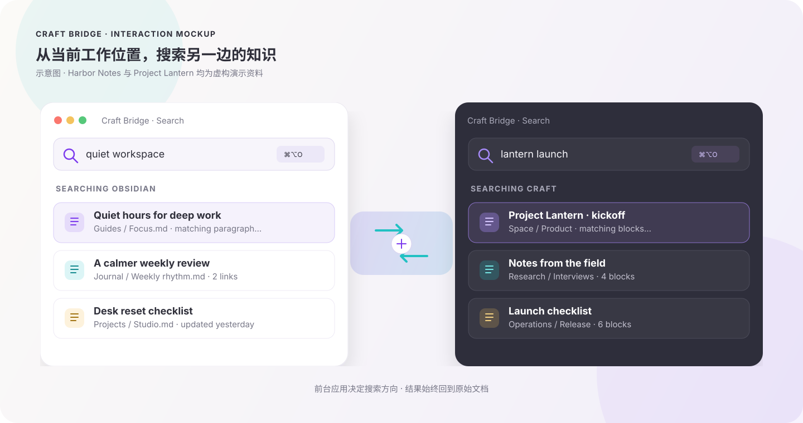
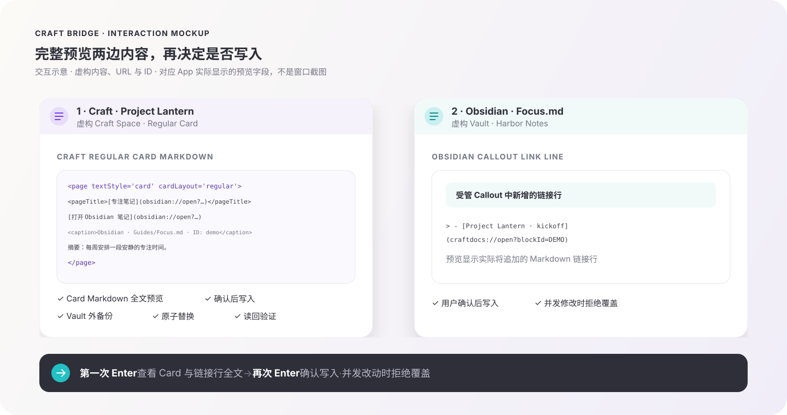
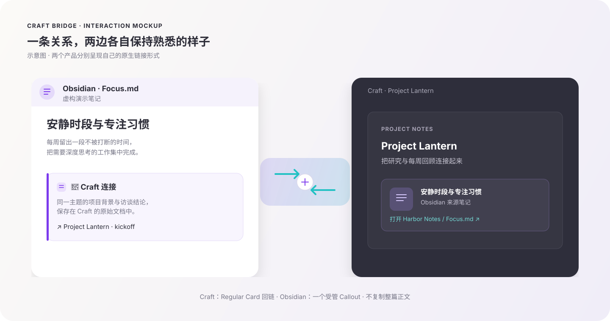
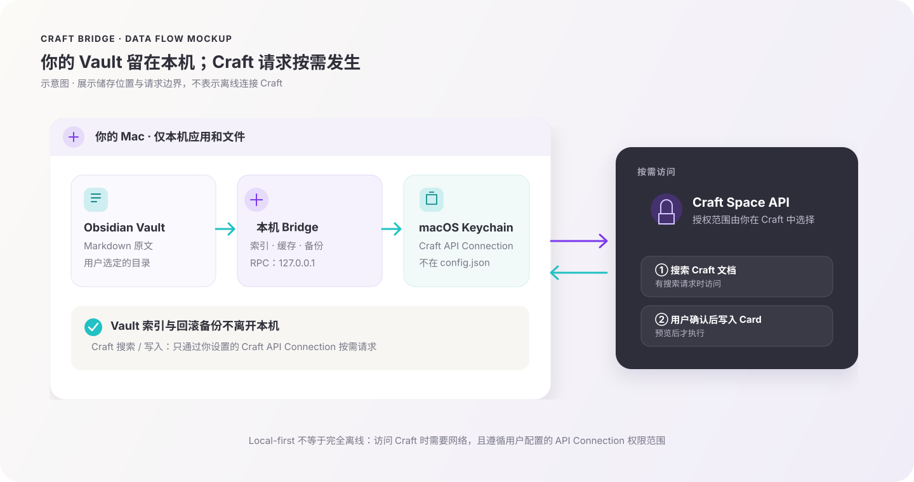
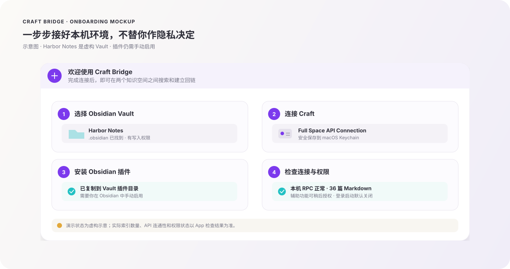
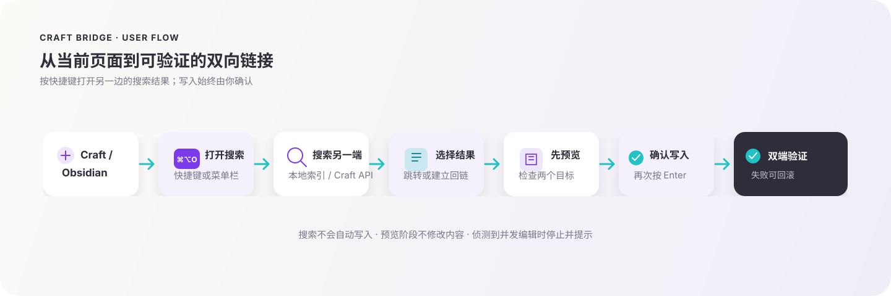
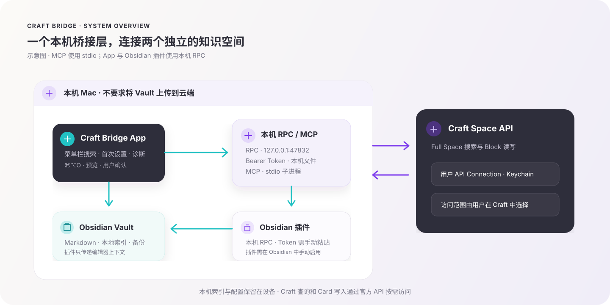

<p align="center">
  
</p>

<p align="center">
  <a href="#功能展示">功能展示</a> ·
  <a href="#工作流">工作流</a> ·
  <a href="#快速开始">快速开始</a> ·
  <a href="#工作原理">工作原理</a> ·
  <a href="#隐私与安全">隐私与安全</a>
</p>

<h1 align="center">Craft Bridge</h1>

<h3 align="center">在 Craft 与 Obsidian 之间搜索、跳转，并建立安全可回滚的双向连接。</h3>

<p align="center">
  不再靠复制粘贴找回上下文。一个快捷键定位另一端，完整查看两边将写入的内容后再确认。
</p>

<p align="center">
  
  
  
  
  
  <a href="LICENSE"></a>
</p>

Craft Bridge 由一个独立的 macOS 菜单栏 App、本地 Bridge/MCP 服务和 Obsidian 桌面插件组成。它不是 Craft 编辑器的原生插件，也不会把 Obsidian Vault 同步或镜像到 Craft。

> 本页功能图是根据虚构的「Harbor Notes」演示 Vault 和「Project Lantern」Craft 空间绘制的交互示意，不是私人资料截图，也不代表每个 macOS 版本的逐像素界面。

## 功能展示

### 1. 一个快捷键，搜索另一端的内容

<p align="center">
  
</p>

按下 `⌘⌥O` 打开搜索器。Craft 位于前台时搜索 Obsidian；Obsidian 位于前台时搜索 Craft。选中结果后可以跳转到原文。未授权辅助功能时，仍然可以从菜单栏手动打开搜索器。

### 2. 写入前先预览两边会发生什么

<p align="center">
  
</p>

第一次按 `Enter` 会展示两端目标与动作、完整的 Craft Regular Card Markdown，以及 Obsidian 中新增的链接行；确认后再次按 `Enter` 才执行。Bridge 会比较预期哈希、创建 Vault 外备份、原子写入并读回校验；发生并发修改时拒绝覆盖，跨端第二步失败时尽可能回滚已验证的一端。

### 3. 两边都留下各自原生的回链

<p align="center">
  
</p>

Obsidian 笔记使用一个可识别、可重复更新的受管 Callout；Craft 文档使用官方 Space API 支持的 Regular Card。两边分别保留适合自己的呈现方式，不会把整篇笔记复制成另一份正文。

### 4. 本地索引、Keychain 与可回滚写入

<p align="center">
  
</p>

Vault 的 Markdown 索引、搜索缓存、配置和备份保存在本机；Craft API Connection 保存到 macOS Keychain。搜索 Craft 时，搜索词会发送到 Craft API；确认建立链接时，Craft Card 会包含目标笔记标题、路径以及最多 280 个字符的上下文摘要。Vault 正文不会整库上传。Obsidian 插件把当前文件路径、行文本和选区发给 `127.0.0.1` 上的本机服务，不会直接连接外网；Craft API 请求由 Bridge 按需发出。

### 5. 首次启动配置与连接诊断

<p align="center">
  
</p>

首次启动会引导你选择 Vault、保存 Craft API Connection、安装插件并检查本机 RPC、索引和 Craft 连接。插件不会被自动启用；你需要在 Obsidian 中手动启用并粘贴本机 Token。登录时自动启动默认关闭。

## 工作流

<p align="center">
  
</p>

```text
Craft / Obsidian → ⌘⌥O → 搜索另一端 → 选择 → 预览 → 确认 → 双端验证
```

## 快速开始

### 下载并安装

1. 从 [GitHub Releases](https://github.com/ezbug/craft-bridge/releases/latest) 下载 `CraftBridge-v0.1.0-macos-arm64.zip`、`craft-obsidian-bridge-plugin-v0.1.0.zip` 和 `SHA256SUMS`。
2. 将三个文件放在同一目录，在终端运行 `shasum -a 256 -c SHA256SUMS`，确认两个压缩包的 SHA-256 校验均通过。
3. 解压后将 `CraftBridge.app` 移入「应用程序」，首次打开并完成引导（Finder 中显示为 Craft Bridge）。

Obsidian 插件也作为独立文件发布：`craft-obsidian-bridge-plugin-v0.1.0.zip`。可让 App 自动安装，也可按 [插件安装说明](obsidian-plugin/README.md) 手动复制插件文件。

首版 App 面向 Apple Silicon，最低支持 macOS 13。App 使用 ad-hoc 签名，尚未使用 Developer ID 签名或 Apple 公证；macOS 可能提示无法验证开发者。确认下载来源和 SHA-256 后，若系统提供「仍要打开 / Open Anyway」，可在「系统设置 → 隐私与安全性」中对这一个 App 作出例外选择。请勿关闭 Gatekeeper 或降低整台 Mac 的安全设置。更多说明见 [Apple 的安全打开 App 指引](https://support.apple.com/en-us/102445)。

### 完成首次设置

1. 在 Craft Bridge 中选择一个包含 `.obsidian` 文件夹且可写入的 Obsidian Vault。
2. 按照 [Craft API 官方说明](https://support.craft.do/en/integrate/api)，从 Craft 的 Imagine/API 页面创建 API Connection。若需要跨整个 Space 搜索，请选择对应的 Full Space Connection，并自行确认授权范围。
3. 将 API Connection 粘贴到 App。它会保存到 macOS Keychain，不会写入普通配置文件或发行包。
4. 让 App 安装 Obsidian 插件；在 Obsidian → 设置 → 第三方插件中手动启用 Craft Bridge。
5. 从 App 复制本机 Bridge Token，粘贴到插件设置。然后刷新 App 内诊断并测试 Craft 连接。
6. 需要全局快捷键时，在系统提示后授予辅助功能权限。没有授权时，仍可用菜单栏按钮打开搜索器。

插件设置可能随 Obsidian Vault 同步。若不希望本机 Token 进入同步范围，请关闭该插件设置文件的同步，或使用不含该设置的 Vault；不要把 Token 分享、截图或提交到 Git。

如果你遇到首次打开的系统拦截，请先确认来源和校验值，再按 Apple 文档对该 App 单独选择「仍要打开」。如果 macOS 提示 App 已损坏或检测到恶意软件，请不要绕过提示；重新下载并报告问题。

## 工作原理

<p align="center">
  
</p>

- **macOS 菜单栏 App**：搜索、预览、确认写入、Vault 选择和运行诊断。
- **本地 Bridge**：提供只绑定 `127.0.0.1` 的 RPC，以及可由 MCP 客户端通过 stdio 启动的工具服务。
- **Obsidian 插件**：读取当前 Markdown 编辑器上下文，并在用户确认后写入或回滚光标处链接；不负责索引。
- **Craft Space API**：按需搜索 Craft 文档、插入并验证 Regular Card。Craft 端实际可访问的资料范围由用户创建的 API Connection 决定。

Craft Bridge 通过 Craft 官方 API 工作，不是在 Craft 编辑器内部运行的扩展。Full Space API 提供全空间搜索以及 block 读写接口；请参阅 [Craft API 说明](https://support.craft.do/en/integrate/api) 和 [Space API 文档](https://connect.craft.do/api-docs/space)。

### 本机数据位置

| 数据 | 默认位置 | 说明 |
|---|---|---|
| 用户配置 | `~/Library/Application Support/craft-obsidian-bridge/config.json` | Vault 路径、名称、端口、登录启动选项；不包含 Craft API Connection |
| Craft API Connection | macOS Keychain | 通过 App 保存；不进入 `config.json` 或日志 |
| Bridge Token | `~/Library/Application Support/craft-obsidian-bridge/bridge.token` | 本机 RPC Bearer Token；文件权限限制为当前用户 |
| Obsidian 搜索索引 | `~/Library/Application Support/craft-obsidian-bridge/index.sqlite` | 由 Markdown 笔记生成的本地索引 |
| 回滚备份 | `~/Library/Application Support/craft-obsidian-bridge/backups/` | 用于经验证写入的本地恢复；默认保留 30 天 |

配置结构和环境变量见 [`obsidian-bridge/README.md`](obsidian-bridge/README.md)。未知的配置 schema 版本会拒绝启动，不会被静默覆盖。

## MCP 高级配置

菜单栏 App 是推荐入口，无需单独安装 Node.js。若你希望在兼容的 MCP 客户端中直接启动 stdio 服务，可从源码构建；该开发方式需要 [Node.js 22.23.2（Jod LTS）](https://nodejs.org/en/download/archive/v22.23.2/) 或更新的 Node 22 版本、Xcode Command Line Tools 和一份你自己选择的 Obsidian Vault。

```bash
cd obsidian-bridge
npm ci
npm run build
```

MCP 客户端配置示例（请替换 `PATH_TO_CRAFT_BRIDGE` 和 Vault 路径；不要把真实 Craft API Connection 写进配置）：

```json
{
  "mcpServers": {
    "craft-obsidian-bridge": {
      "command": "node",
      "args": ["PATH_TO_CRAFT_BRIDGE/obsidian-bridge/dist/src/index.js"],
      "env": {
        "OBSIDIAN_VAULT": "/absolute/path/to/your/Obsidian Vault",
        "OBSIDIAN_VAULT_NAME": "Your Vault"
      }
    }
  }
}
```

主要 MCP 工具包括 `search_obsidian_notes`、`read_obsidian_note`、`list_obsidian_backlinks`、`preview_obsidian_link_change`、`apply_obsidian_link_change` 和 `rollback_obsidian_link`。完整配置说明、环境变量和安全边界见 [Bridge 开发说明](obsidian-bridge/README.md)。

## 开发与验证

需要 Node.js 22.23.2（或兼容的 Node 22）、macOS 13+ 与 Swift 工具链。运行 Bridge 和插件检查：

```bash
cd obsidian-bridge && npm ci && npm test && npm run lint && npm run build
cd ../obsidian-plugin && npm ci && npm test && npm run lint && npm run build
cd ../macos/CraftBridgeApp
swift run CraftBridgeCoreTests
```

不要用真实 Vault 或真实 Craft 内容作为自动化测试数据。请先读 [贡献指南](CONTRIBUTING.md)；第三方组件信息见 [THIRD_PARTY_NOTICES.md](THIRD_PARTY_NOTICES.md)。

## 隐私与安全

- Bridge RPC 仅监听本机回环地址 `127.0.0.1`，并校验本机 Bearer Token。
- Obsidian 内容在本机建立索引。搜索 Craft 时，搜索词会发送到 Craft API；确认建立双链时，Card 会写入目标标题、Vault 路径和最多 280 个字符的上下文摘要。完整 Vault 不会上传。
- API Connection 存于 macOS Keychain；它不会被放进公开源码、日志、配置 JSON 或 ZIP。
- 插件的 Token 保存在 Obsidian 插件设置中；若 Vault 同步该设置，Token 也可能被同步。请确认你的同步边界。
- 写入采用预览、哈希校验、备份、原子替换、读回验证；检测到并发修改时拒绝覆盖。
- 诊断日志位于 `~/Library/Application Support/craft-obsidian-bridge/CraftBridgeApp.log`。提交日志前，请检查并删除 Vault 路径、Craft 文档标题或其他个人信息。
- 本项目不提供自动更新、Homebrew 安装，也尚未提交 Obsidian Community Plugins 商店。

发现安全问题时，请按 [SECURITY.md](SECURITY.md) 私下联系维护者，不要公开贴出 Token、Craft API Connection、Vault 内容或可复现的私人数据。

## 已知边界

- 当前发行包仅支持 Apple Silicon 和 macOS 13+；Obsidian 插件仅支持桌面版，最低版本见 `manifest.json`。
- 需要用户自行创建 Craft API Connection；API Connection 的授权范围决定 Craft Bridge 能读取和写入哪些文档。
- 首版 App 未经 Apple 公证，系统可能要求用户逐 App 确认是否打开。
- 插件需要用户手动启用，并在设置中粘贴本机 Token。
- 不会自动写入 Obsidian 插件启用列表、修改 Craft API 权限或上传整个 Vault。

## 卸载

1. 在 Craft Bridge 设置中关闭「登录时自动启动」，然后从菜单栏退出 App。
2. 在 Obsidian 设置中禁用 Craft Bridge，再从 `你的 Vault/.obsidian/plugins/craft-obsidian-bridge/` 移除插件文件夹。
3. 将「应用程序」中的 `CraftBridge.app` 移到废纸篓（Finder 中显示为 Craft Bridge）。
4. 可选：若确定不再需要配置、索引、Token 和回滚备份，再删除 `~/Library/Application Support/craft-obsidian-bridge/`。此操作不会删除 Vault 中由 Bridge 添加的链接；Vault 内的受管 Callout 需要你在 Obsidian 中自行检查和清理。

## 致谢与许可证

Craft Bridge 采用 [MIT License](LICENSE)。Craft 和 Obsidian 为各自所有者的商标或产品；本项目与两家公司没有隶属关系。
